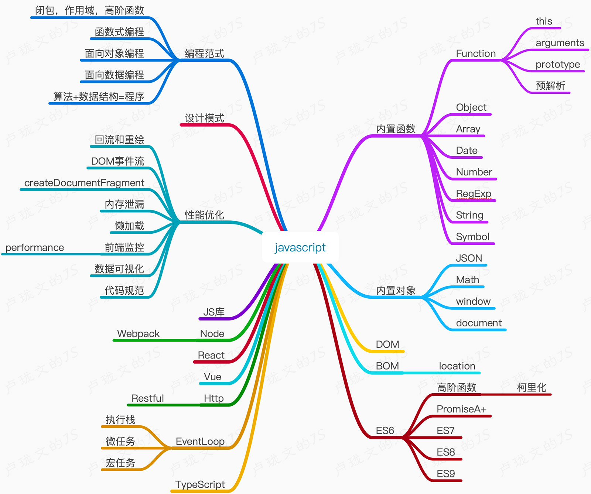

# 卢珑文的 JavaScript 技术栈

> Author: 卢珑文  
> Email: lulongwen@live.com  
> Wechat: 18915972355  
> Website: https://www.lulongwen.com  
> Github: https://github.com/lulongwen  

## 1 JS技术学习路线

1. callback
2. promise
3. es6
4. class
5. event-loop
6. node
7. npm
8. node-core
9. buffer
10. stream
11. http
12. koa
13. express
14. webpack
15. typescript
16. vue
17. react

18. **大前端时代的变化**

* SPA
* MVVM 前端工程化
* 跨端 UniApp & Flutter
* Node 全栈

## 2 JS数据结构

## 3 JS算法

## 4 JS设计模式

## 5 JS性能优化

## 6 ES6-10

## 7 TypeScript

## 8 JS数据可视化

## Javascript基础

1. 内置函数
	- Array
	- Object
	- Function
	- Boolean
	- Date
	- Number
	- String
	- Symbol

2. 内置对象
	- RegExp 正则表达式
	- Math
	- JSON
	- window
	- document

3. DOM
4. BOM
5. Event事件

## JS 框架

1. Vue
2. React

## JS库

1. TweenMax
2. Swiper.js
3. anime.js

## Nodejs

1. koa
2. express
3. eggjs
