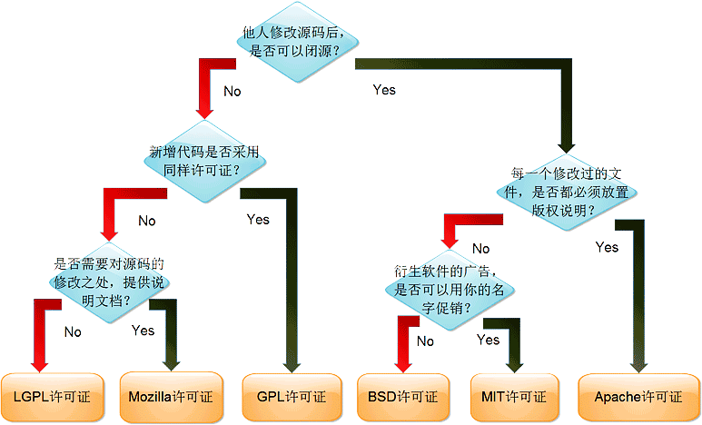

# 开源协议

## MIT

1. 最宽松的协议
2. 作者只想保留版权,而无任何其他了限制

## GPL v3

GNU General Public License

1. 不允许修改后和衍生的代码做为闭源的商业软件发布和销售
2. GPL/LGPL都保障原作者的知识产权，避免有人利用开源代码复制并开发类似的产品
3. 修改后的软件是否能换License: NO；否则一换，996公司又可以用你的项目了
4. 是否可以私有使用：可以；毕竟新增的东西可能是需要保密的

## LGPL

GNU Lesser General Public License，LGPL是GPL的一个为主要为类库使用设计的开源协议

## 2 [如何选择一个开源协议](http://choosealicense.online/)

