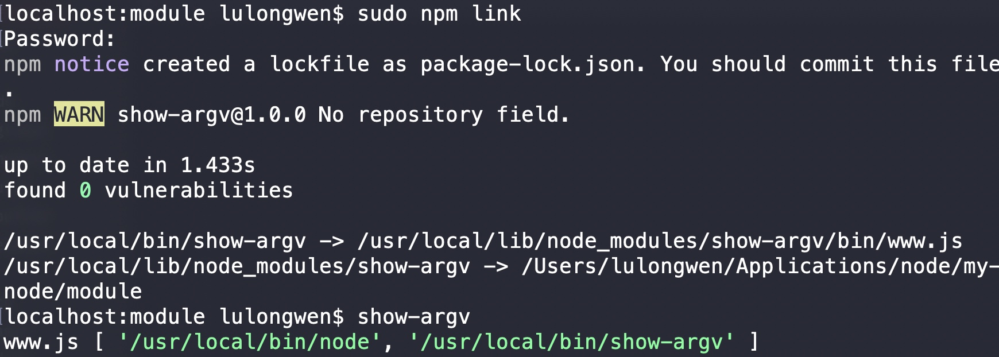

# npm 模块

[发布自己的 npm包](nodejs/npm/publish)

## 1 npm 命令

1. 查看全局安装包

```bash
yarn global list --depth=0
  
npm list -g --depth=0
```


2. 安装全局包

```bash
yarn global add @vue/cli
```

3. 删除全局包

```bash
npm uninstall -g @vue/cli

yarn global remove vue-cli
```


## 2 npm 模块

1. npm 可以帮我们安装模块，安装node 会自动安装npm
  - [npm](https://www.npmjs.com) 是 node.js 默认的模块管理器，用来安装和管理node 模块
  - 多个模块可以封装成一个包
    
2. npm 模块分2类：
  - 全局模块 在命令行中使用
  - 项目安装 在当前项目使用
    
```jsx
开发依赖项，本地开发需要的，上线不需要
--save-dev -D
    devDependencies: {}

项目依赖，上线也需要
--save -S
    dependencies: {}

nrm npm源管理

mvm node版本管理
```


## 3 `npm install` 

`npm install` 安装第三方模块

1. 全局安装，直接下载到 node的安装目录中，各个项目都能用，适合工具模块
  - 比如 `gulp` `webpack`
  - `npm install gulp -g`
  - `npm install webpack -global`
    
2. 项目安装：本地安装，将一个模块下载到当前目录的 node_modules 目录下
  - 只有在当前目录和它的子目录中才能调用模块

```bash
npm install axios --save
npm install axios -S

npm install node-sass --save-dev
npm install node-sass -D
```
    
3. 第三方模块，不需要 ./ 方式引入；直接通过包名将文件引入
4. 查找 `package.json` 中的 `main` 对应的文件运行；如果当前目录下没有找到，会向上一级查找，找到计算机的根目录为止

```
let $ = require('jquery')

console.log('jquery', $)
console.log('path', module.paths)

```
    

### 把本地项目变成一个全局命令

1. `bin` 
2. `npm link` 把当前的包连接到 npm下
  - 在那个目录下，就会把文件链接过去




## 4 npm技巧

1. 如果项目中添加了 `.npmignore`文件，`.gitignore`中的规则就会被忽略，这时候你还需要维护两份儿规则文件
  - 没有使用 `.npmignore`文件，那么它默认匹配的是 `.gitignore`中的规则
2. 切换到生产环境时，安装依赖包时一定要带上 `--production`参数
  - 将只会安装你的 dependencies依赖，而忽略你的 devDependencies依赖
  
```jsx
// 打开 package主页，会打开lodash的主页。不管你机器中是否安装
npm home lodash

// 打开 package的 Github仓库地址
npm repo lodash

// 检查 package.json过时的依赖
npm outdated

// 没有用到的 packages; npm会拿你的package.json 和node_modules目录进行比对，然后把那些在package.json中没有引用到的package列出来
npm prune

// 锁定依赖版本，项目中生成一个npm-shrinkwrap.json文件类；当前package.json中引用的依赖版本锁定
npm shrinkwrap

// npm install -g时，不用再加sudo
npm config set prefix $dir

// ~ 副版本， ^ 主版本
npm config set save-prefix="~"

// 自定义 init 脚本内容
npm config set init-module ~/.npm-init.js

// npm init 默认配置
npm config set init.author.name $name
npm config set init.author.email $email
```
