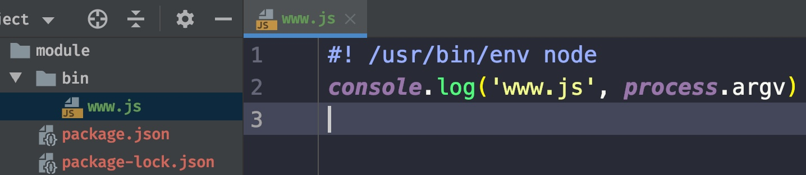
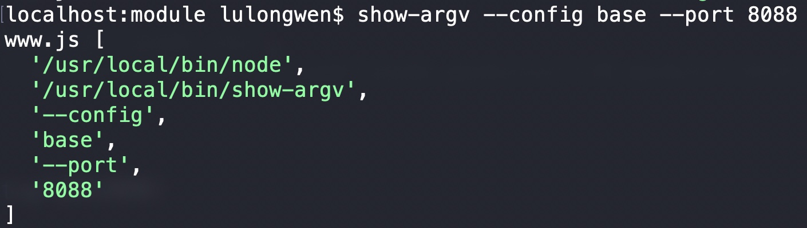
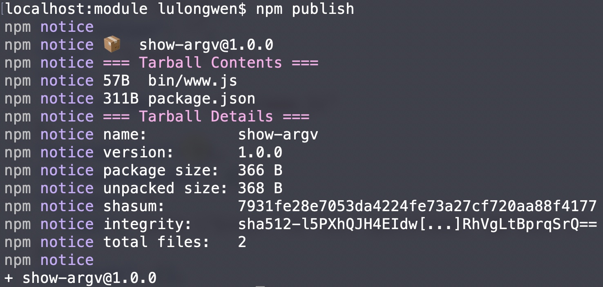

# 发布npm包

## 1 创建自己的组件

1. npm init 初始化项目
2. 修改 `package.json`
    - 修改 `main.js` 输出自己的组件即可使用
    - 组件上线前必须编译打包好

```jsx
{
    "private": false,
    "main": "dist/vue-count.min.js"
}
```


## 2 npm publish 发布

1. cmd 登录账号 npm login
2. 将自己写的 `npm`包发布到 `www.npmjs.com`，cmd 先回到 npm `nrm use npm`
2. 包名不能和已有的包名重复
3. 入口文件 `main.js，做整合用的
4. 注册 `www.npmjs.com` 账号
	* 如果有账号，表示登录
	* 新用户需要校验邮箱

```bash
npm addUser # 输入用户名，密码，邮箱

npm publish # 在要发布的那个目录输入 npm publish

```

## `bin package.json`

1. bin-package设置



2. npm-link 连接到全局，当前项目全局化


2.1 show-argv 测试


3. npm 发布包


4. `npm install show-argv` 安装包
