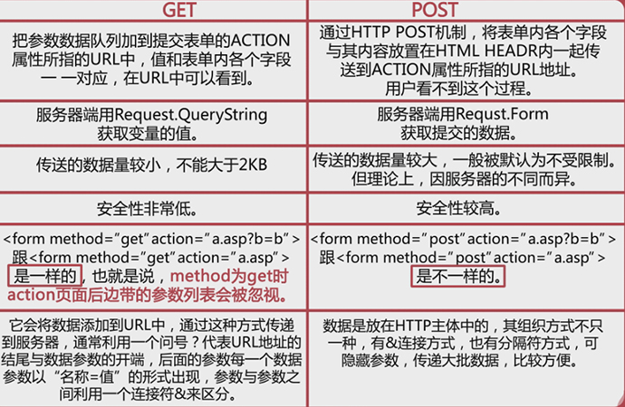
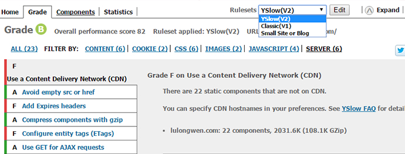
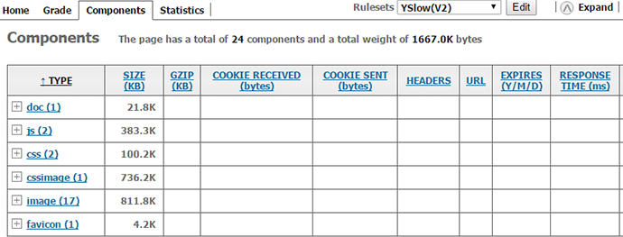

## 如何让用户更快的打开网站
- 35条之多，技术人员统称为yahoo军规

1. 尽可能减少HTTP请求数
	+ 当你打开网页的时候，你所看到的文字，图片，多媒体等，内容都是你从服务器上获取的，每一个内容的获取就是一个http请求。
	
2. 压缩、合并Javascript和CSS
    + 去除不必要的空白符、格式符、注释符
    + 简写方法名、函数名压缩JS文件
    + 正式上线前，将JS、CSS都进行压缩，让线上版本是最轻量级，大幅提升网站性能。

3. 使用CDN
	+ CDN的全称是Content Delivery Network，即内容分发网络。
	+ 尽可能避开互联网上有可能影响数据传输速度和稳定性的瓶颈和环节，让内容传输的更快，更稳定。
	+ 多个服务器来实现

4. 添加ExPire/Cache-Control头
    + CACHE-CONTROL 是http协议中常用的头部之一，控制页面的缓存机制
    + 如果该头部指示缓存，缓存的内容也会存在本地，cache-control有更多的选项
    
	

5. 启用Gzip压缩
    + 本地压缩后，上传服务器，服务器再Gzip压缩，文件体积会更小
    + 支持 html、css、javascript、image、txt、xml
    
6. 将CSS放在页面最上面
    + 避免出现打开浏览器页面空白、页面闪烁
    
7. 将Script放在页面最下面
    + 要知道DOM加载顺序
    + html > head > meta > title > style/link:css > body > script
    + 先将内容呈现出来，如果JS报错或死循环，用户还可以看到页面
    
8. 避免在CSS中使用 Expressions （CSS表达式）
    + CSS表达式是用来把 CSS属性和js关联起来，CSS的值等于JS计算的结果
    + Expressions 计算频率：
        + 页面显示和缩放
        + 页面滚动
        + 鼠标移动
        + 都会计算一次，随便移动一次鼠标，都会计算1万次以上

9. 把Javascript和CSS都放到外部文件中
    + 单独提取
        + 提高了JS和CSS的复用性
        + 减少了页面体积
        + 提高了JS和CSS的可维护性
        
    + 写在页面内
        + 减少页面请求
        + 提升页面渲染速度
        
    + 什么时候写在页面内？
        + 只应用于一个页面，如404页面，邮件页面
        + 不经常被访问到
        + 脚本和样式很少

10. 减少DNS查询
    + DNS查询有 20ms
    + DNS缓存
        + IE 30m （30分）
        + chrome、firefox 60s （60秒）
        + safari 约为 10s
    + DNS缓存时间长时，减少DNS的重复查找，节省时间
    + DNS缓存时间短时，及时的检测网站服务器的变化，保证正确性
    + 根据自己网站的特点采用 单域、 多域放置资源来减少DNS查询

11. 避免重定向
    + 重定向：用户的原始请求被转向了其他请求
    + 重定向状态码： 301、302
        + 301 被移动到了另外的位置（永久重定向）
        + 302 临时重定向
    + 重定向增加了浏览器和服务器的返回次数，违背了减少http请求次数
    
12. 移除重复的脚本

13. 配置实体标签（ETag）
        + Entity Tag（实体标签）
        + 属于HTTP协议
        + 受web服务支持
        + 类似于文件的版本号
    
14. 使用Ajax缓存
    + post 每次都执行，不会缓存
    + get 同一地址不重复执行，可以被缓存
    
    

15. Yslow 网站性能优化工具
    - (Yslow 分析工具)[http://yslow.org/mobile/]
	- chrome、firefox
	- Rulesets：
	    + YSlow（V2） 22个测试规则
        + Classic（V1） 13个测试规则
        + Small Site or Blog 14个测试规则
        + Grade ：等级视图，网页评分:A - F,A最好
        + Components：组件视图，检视各个元素占用空间大小
        + Statistics：统计信息视图，与Components相似
        + Yslow 对网站进行分析，给一些建议，一些规则；一步一步的优化自己的网站
	
	
	
	
	
	    
16. 请减少对DOM的操作
	- 《高性能JavaScript》中这么比喻：“把DOM看成一个岛屿，把JavaScript(ECMAScript)看成另一个岛屿，两者之间以一座收费桥连接”。
	- 所以每次访问DOM都会教一个过桥费，而访问的次数越多，交的费用也就越多。所以一般建议尽量减少过桥次数。
	- ** 合理的使用JavaScript变量储存内容，考虑大量DOM元素中循环的性能开销，在循环结束时一次性写入 **
