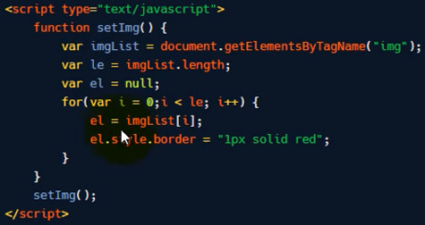
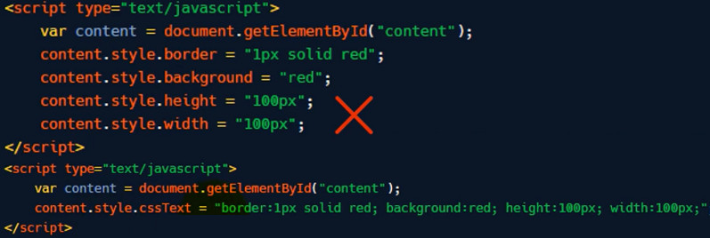
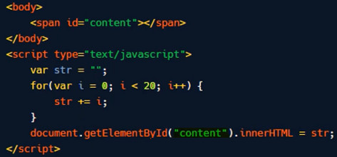

# DOM 优化

* 将 js 脚本文件放到 </body> 的前面；
* 减少页面中 script 标签的数量；
* element.cloneNode() 比 element.createElement() 效率要高；
* 将 DOM 集合转存到数组中，进行遍历；访问集合元素时，使用局部变量；
    * 

* 合并所有样式处理，只修改一次 DOM 优化性能；
    * 

    * 
