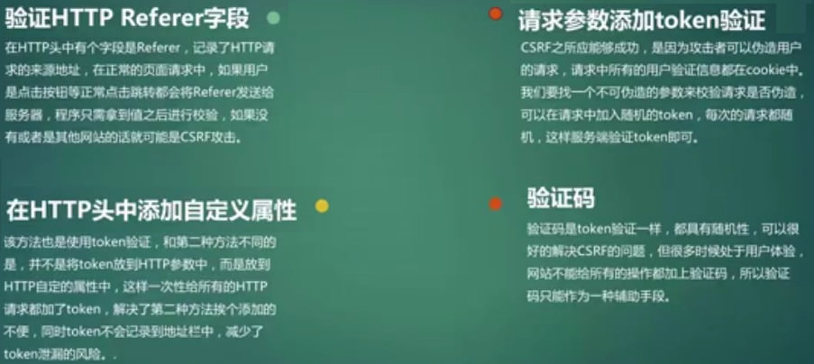
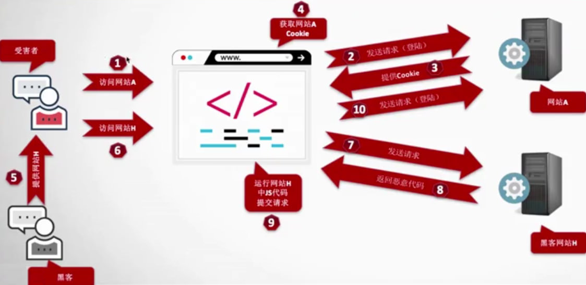

# CSRF 跨站请求伪造

* Cross-Site Request Forgery
* 攻击者在【一定攻击条件下】，利用被攻击者的身份，向服务器发起请求，
* 服务器可以正常解析并返回正确结果。

## CSRF 防御

1. 验证 http Referer 字段
2. 请求参数添加 token 验证
3. 在 http请求头中添加自定义属性
4. 验证码，辅助验证

## CSRF 发生的条件

1. 被攻击者在，网站A 是登录状态
2. 必须要在，网站A 同浏览器中打开黑客提供的链接
3. 后台身份验证不严格，例如：除了 cookie，没有其他验证

## CSRF 能做什么？

* 发邮件
* 发消息
* 财产操作，比如：转账，购买商品
* 修改密码
* 删除文章