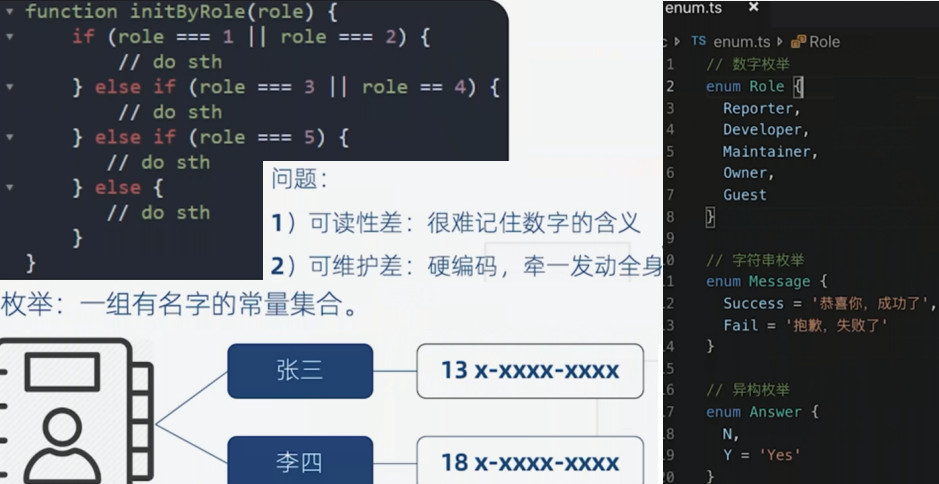

# typescript 类型检查

1. boolean 布尔值
2. number 数值
3. string 字符串
4. array 数组
5. tuple 元祖
6. enum 枚举值

7. any
8. void
9. null & undefined
10. never
11. object

12. 类型断言


## 基础类型

```ts
// 布尔值
let flag: boolean
flag = true

// 数值
let num: number = 123
num = 0b1111011 // 二进制
num = 0o173 // 八进制
num = 0x7b // 16进制


// 字符串
let str: string
str = 'abc'
str = `str is ${num}`

```


## array 数组

```ts
// 数组里面是 number类型
let arr: number[]
arr = [3]

// 数组的不同写法
let arr2 = Array<number>

let arr3 = (string | number)[]
arr3 = ['a', 2]

```


## tuple 元祖

不能多写，也不能少写，多少都会报错

```ts
let tuple: [string, number, boolean]
tuple = ['a', 200, true]

```


## enum 枚举

枚举值默认从 0 递增，可以指定值



```ts
enum roles {
	super_admin,
	admin = 3,
	guest,
	user
}

roles.super_admin

```


## object 对象

```ts
let obj = {
	name: 'longwen'
}
let obj2 = obj // 对象：引用类型，堆

obj2.name = 'lucy'

function getObject(obj: object): void {
	return obj
}
getObject(obj2)
```


## any 类型

任意类型的值，尽量少用

```ts
let value: any

value = 'abc'
value = 123

const arr: any[] = ['ok', 300]
```


## void 类型

```ts
const fn = (text: string): void => {
	return text
}

let value: void
value = null
value = undefined


// undefined & null
let ud: undefined
ud = undefined

let n: null
n = null

// undefined 和 null 都是类型的子类，要关闭 tslint的 strictNullChecks: false
num = undefined
num = null

```


## never 类型

1. never 适用于 报错和 死循环，
2. never 永远不存在的类型

```ts
const error = (info: string): never => {
	throw new Error(info)
}

const infiniteFn = (): never => {
	let i = 1
	while(true) {
		console.log(i++)
	}
}
```


## 类型断言

联合类型，自定义类型保护

```ts
const getLength = (target: string | number): number => {
	if (<string> target).length || (target as string).length === 0) {
		return (<string>target).length
	}
	else {
		return target.toString().length
	}
}
```