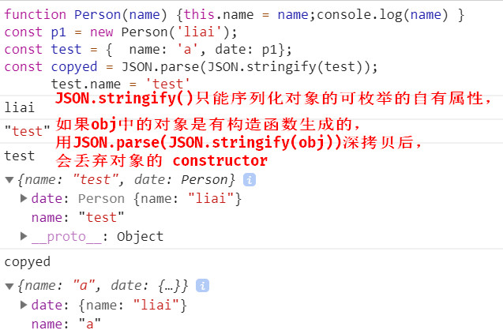
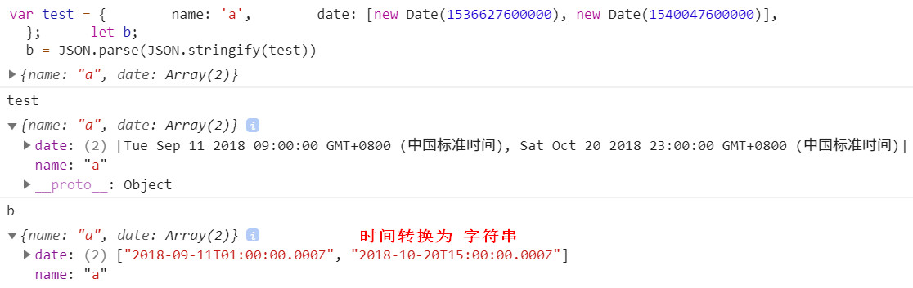
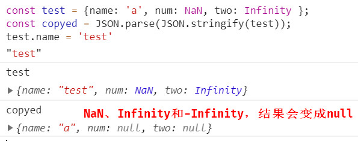
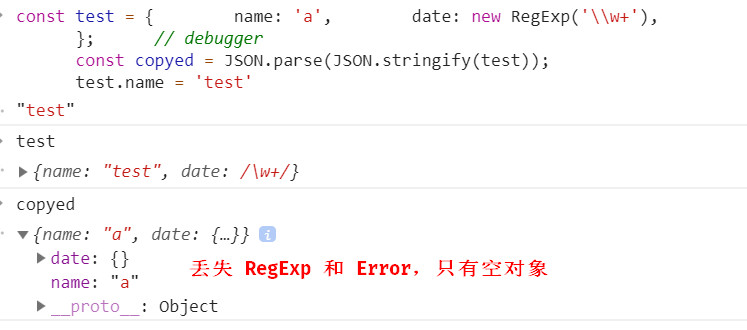
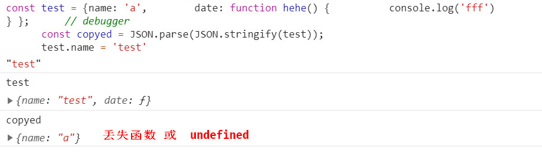

# Object 对象方法

## 1 深拷贝

> 深拷贝，拷贝后的结果更改不会影响之前的数据

### 1 cloneDeep 递归深拷贝

1. 要判断拷贝的值的类型

- 日期 new Date()
- 数组
- 对象
- 函数
- 正则 new RegExp()
- DOM 节点
- prototype 原型的深拷贝

2. 首先判断值的类型，如果是 null, undefiend 或简单类型 直接返回

- 如果是 日期格式，正则，函数，DOM 节点就返回对应的类型，不需要深拷贝
- 函数不需要深拷贝
- 是 [], {} 的话，就进行深拷贝

### 2 JSON.parse()

JSON.parse



Date



NaN - Infinity



RegExp



Function



### 3 合并对象 merge

[对象的深拷贝和浅拷贝](https://github.com/wengjq/Blog/issues/3)

## 2 浅拷贝

1. `...` 展开运算符只能拷贝一层

```js
var obj = { name: "lucy" };
var obj2 = { ...obj };
```
